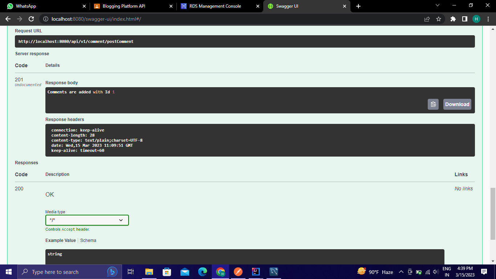

# Blogging Platform API

## Framework And language used
- SpringBoot
- Java

## Data Flow

### Model
1) User
2) Post
3) Comments

### Controller
1) UserController
2) PostController
3) CommentController

### Service
1) UserService
2) PostService
3) CommentService

### Repository
1) UserRepository 
2) PostRepository 
3) CommentsRepository

## DataStructure Used
- HashMap, List

## Project Summary
In this Project User, Post, Comments models are created and controlled by UserController, PostController, CommentController and from controller CRUD operations are performed and different API are provided :

1) User
- PostMapping -> http://localhost:8080/api/v1/user/postUser

- GetMapping  -> http://localhost:8080/api/v1/user/getUserByUserId

- PutMapping -> http://localhost:8080/api/v1/user/updateUser

- DeleteMapping -> http://localhost:8080/api/v1/user/deleteUser

2) Post
- PostMapping -> http://localhost:8080/api/v1/post/savePost

- GetMapping -> http://localhost:8080/api/v1/post/getPostByPostId

- PutMapping -> http://localhost:8080/api/v1/post/updatePost

- DeleteMapping -> http://localhost:8080/api/v1/post/deletePost

3) Comments
- PostMapping -> http://localhost:8080/api/v1/comment/postComment

- GetMapping ->http://localhost:8080/api/v1/comment/getCommentsById

- PutMapping ->http://localhost:8080/api/v1/comment/updateComments

- DeleteMapping -> http://localhost:8080/api/v1/comment/deleteById

 